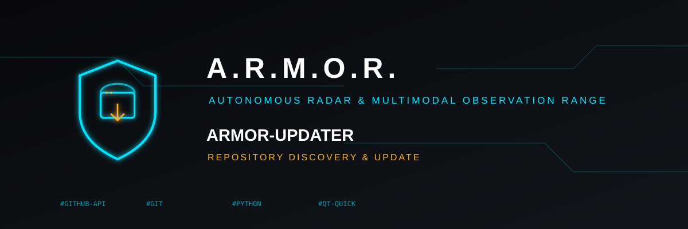

<p align="center">
  
</p>

# 🛠️ ARMOR-UPDATER

<p align="center">
  <a href="README.md">🇺🇸 English</a> |
  <a href="README_spa.md">🇪🇸 Español</a> |
  <a href="README_fra.md">🇫🇷 Français</a> |
  <a href="README_ita.md">🇮🇹 Italiano</a> |
  <a href="README_deu.md">🇩🇪 Deutsch</a> |
  <a href="README_zho.md">🇨🇳 简体中文</a> |
  🇯🇵 <b>日本語</b>
</p>

### 実行しているマシン上であらゆる A.R.M.O.R. リポジトリを検出し、インストールし、更新する(必須の依存関係のない Python プログラムで、最初から非公開のエコシステム向けに作られたもの)

<p align="center">
  
  
  
  
  
</p>

---

**正直さのチェック - 今日動いているもの:** **成熟度:骨組み。** マニフェスト発見、バージョン比較、検証済みでのみ確定するインストール/更新、証跡ログは、A.R.M.O.R. 自身のマニフェスト形式に合わせてテスト済み(103 件のテスト)だが、実際の A.R.M.O.R. リポジトリを最初から最後までインストールまたは更新したことは一度もない。すべてのリポジトリが非公開であり、そのためにはこのプログラムがまだ与えられていない本物の GITHUB_TOKEN が必要だからである。

---

## 🎯 概要

* **固定リストのない発見:** ローカルのフォルダは `ecosystem: "A.R.M.O.R."` を宣言する有効な `armor.project.json` を持てばその時点でエコシステムに加わる。リモートでは `GITHUB_TOKEN` が GitHub 上で見られるすべてのリポジトリを同じ方法で確認する — すべての A.R.M.O.R. リポジトリは非公開なので、このトークンは常に必須であり、公開エコシステムのような 1 時間 60 リクエストという代替手段は存在しない。
* **その場では行わないインストールと更新:** 更新はまず独立したステージング用クローンで構築・検証され、そのビルドが実際に成功したときにのみ昇格される — 2 回のディレクトリ名変更で、以前のインストールはバックアップとして残される。本当にコミットされていないローカルの変更は即座に拒否され、黙って捨てられることはない。
* **証跡:** 成功・失敗を問わず、すべての試行はプロジェクト名、前後のバージョンとコミット、失敗の理由をローカルのログに一行追加する。
* **CLI と任意のデスクトップシェル:** `armor-updater status`/`install`/`update`、およびエコシステムの 7 言語に対応した Qt Quick インターフェース(`pip install ".[gui]"`)。

## 📂 リポジトリの構成

```text
ARMOR-UPDATER/
├── src/armor_updater/  project_manifest, registry, detect (local), github_client (remote, GITHUB_TOKEN required), install (atomic staging-clone
│                       update), evidence, main (CLI), settings, version_parse, i18n, gui/qt_gui/qml (optional Qt Quick shell)
├── tools/              armor_ci_validate.py, _armor_readme_parity.py, armor_project_tool.py (vendored from ARMOR-COMMON), bump_version.py
├── tests/              9 test modules
└── docs/               CLI_REFERENCE.md, QML_DESKTOP_GUI.md
```

## 🛠️ 開発環境

```bash
pip install -e ".[dev]"                                # or ".[dev,gui]" for the optional Qt Quick desktop shell
python -m pytest tests -q                              # 103 tests
armor-updater status                                    # local + GitHub state of every repository (needs GITHUB_TOKEN)
armor-updater install ARMOR-NETWORK                     # clone and build one repository that is not installed yet
armor-updater update ARMOR-NETWORK                      # atomic-by-verification update
```

See `docs/CLI_REFERENCE.md`.

リポジトリが `armor.project.json` の説明するエコシステムに加わる方法は `CONTRIBUTING.md` を参照。

## 🔗 関連プロジェクト

**A.R.M.O.R.**（Autonomous Radar & Multimodal Observation Range）は、独立したリポジトリで構成される周辺警備システムです。それぞれに独自のバージョン、テスト、README があります。ファミリーは次のとおりです：

* **[ARMOR-COMMON](../ARMOR-COMMON)** - メッセージ契約、検証器、適合性ベクトル、生成された型
* **[ARMOR-RADAR](../ARMOR-RADAR)** - ESP32-S3 用フィールドノードのファームウェア。レーダー 3 基と独自の Web パネル付き
* **[ARMOR-SOLAR](../ARMOR-SOLAR)** - 太陽光インバーターとバッテリーのプロトコル、およびゲートウェイノードのメッセージ
* **[ARMOR-ELECTRICAL](../ARMOR-ELECTRICAL)** - 電気ノード：電力量計、電力網の計測メッセージ、開閉のルール
* **[ARMOR-NETWORK](../ARMOR-NETWORK)** - ローカルネットワーク：機器、インターネット、そして変化
* **[ARMOR-SERVER](../ARMOR-SERVER)** - 中央コーディネーター：テレメトリ、アラーム、デバイス、太陽光の測定値、カメラ
* **[ARMOR-STUDIO](../ARMOR-STUDIO)** - Web コンソール：カメラ、レーダー、アラーム、太陽光発電、2D/3D サイト設計
* **[ARMOR-ANDROID-CONTROL](../ARMOR-ANDROID-CONTROL)** - リアルタイム 2D/3D レーダー付きの Android オペレータークライアント
* **[ARMOR-SERVER-AI](../ARMOR-SERVER-AI)** - 判断を説明し、決して動作しない視覚推論ポリシー
* **[ARMOR-VOICE-AI](../ARMOR-VOICE-AI)** - 偽造できない確認を備えたオフライン音声インテント
* **[ARMOR-HARDWARE](../ARMOR-HARDWARE)** - 筐体、電子部品、ベンチ受け入れマトリクス
* **[ARMOR-DEVOPS](../ARMOR-DEVOPS)** - デプロイ、CM5 テストベンチ、バックアップ、TLS
* **[ARMOR-SIMULATOR](../ARMOR-SIMULATOR)** - 再現可能な故障を備えたオフラインのテレメトリシミュレーター
* **ARMOR-UPDATER** (このリポジトリ) - エコシステム自身のリポジトリを検出し、インストールし、更新する
* **[ARMOR-DOCS](../ARMOR-DOCS)** - アーキテクチャ、セキュリティ基準、機能マトリクス

## 📚 ドキュメントとコミュニティ

詳しくは：

* [機能マトリクス：実証済みのものとそうでないもの](../ARMOR-DOCS/docs/CAPABILITY_MATRIX.md)
* [プロジェクト一覧：バージョンとリポジトリ間の依存関係](../ARMOR-DOCS/docs/PROJECT_CATALOG.md)
* [このリポジトリの変更履歴](CHANGELOG.md)
* [ライセンス（GPL-3.0-or-later）](LICENSE)
* 質問・提案・報告：electrohobby3d@gmail.com

## 👤 作者

**JuanenRac (Electro Hobby 3D)** · electrohobby3d@gmail.com

## 📜 ライセンス

GPL-3.0-or-later - [LICENSE](LICENSE) を参照。
